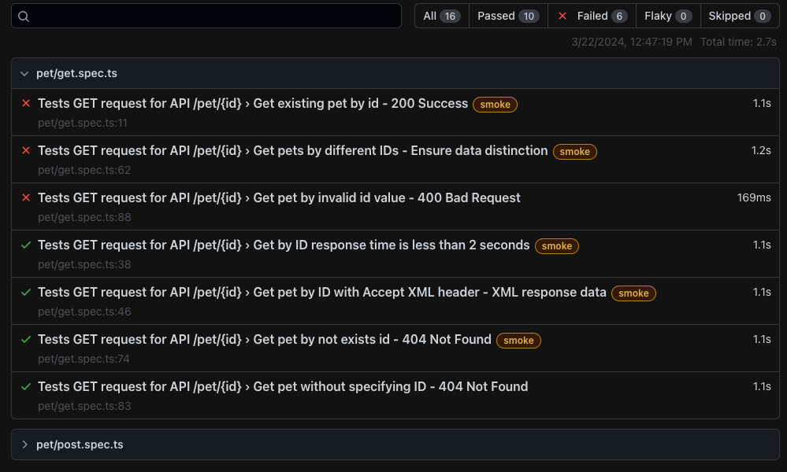

# Project Overview
This repository contains 2 test automation projects. 

* `api-tests` - API tests for a "Pet Store" open-source server.
* `gui-tests` - GUI tests for a "Scheduler" web application.

Projects has been tested and verified with `Node.JS 21.7.1` on `MacOS Sonoma 14.4` and `Windows 11`.

The projects are written in `TypeScript` and utilize `Playwright 1.42.1` test automation framework.


### Why Playwright?
`Playwright` is a powerful test automation framework that allows you to write tests in `TypeScript`, `JavaScript`, `Python`, and `C#`.

Some of the features `Playwright` provides:
* Parallel execution.
* Cross-browser testing.
* Easy to set up, config and manage multiple projects.
* Built-in reporting capabilities.
* Easy to debug and troubleshoot.

These are just few of many features `Playwright` offers. Refers to the [documentation](https://playwright.dev/) for more details.

---

# Installation

1. First, clone the repository to your local machine:
    ```bash
    git clone https://github.com/AmirYa412/Playwright-TypeScript-Automation.git
    ```

2. Install `Node.js` from [here](https://nodejs.org/en/download/).

3. Install the project's dependencies from root, it contains the dependencies for both projects.
    ```bash
    npm install
    ```

4. Each project has its own `.env.template` file which contains the `BASE_URL` & `PROTOCOL` for each project.

   Rename it to `.env` to be able to run the tests for each project, or you can copy it to a new `.env` file in each project's root directory.
   
    ```bash
    cp api-tests/.env.template api-tests/.env
    cp gui-tests/.env.template gui-tests/.env
    ```
   For Windows Terminal, use the copy command:
   ``` cmd
   copy api-tests\.env.template api-tests\.env
   copy gui-tests\.env.template gui-tests\.env
   ```

5. Run test commands in **#Usage** section.
6. If you are getting `Error: browser.Type.launch: Executable does not exist at` when running `gui-tests`,

   Run this command to manually install browsers binaries:
   ```bash
   npx playwright install
   ```

---

# Configuration
`Playwright` picks a single `playwright.config.ts` per test run. Each project has its own config file.
You can read more about test configurations in https://playwright.dev/docs/test-configuration.

### Main config options used:


| Configuration Option | Description                                                                                                                                       |
|----------------------|---------------------------------------------------------------------------------------------------------------------------------------------------|
| `testDir`            | Directory where `Playwright` will look for tests.                                                                                                 |
| `timeout`            | Timeout for each test in milliseconds.                                                                                                            |
| `expect["timeout"]`  | Timeout for assertion in each test.                                                                                                               |
| `fullyParallel`      | Run tests in parallel or not.                                                                                                                     |
| `retries`            | Number of retries for each test.                                                                                                                  |
| `workers`            | Number of workers to run tests in parallel. Locally it sets to `undefined`, meaning `Playwright` automatically determine the amount of workers.   |
| `reporter`           | The reporter to use for test result output. Accepts: `json`, `html`, `verbose`, `minimal` and more.	                                              |
| `use`                | Object containing shared settings for all projects, such as browser flags, headless mode, `baseURL` for browser and more.                         |
| `projects`           | Array of objects to define on which browsers tests should be executed. You can uncomment  to run on different browser on `gui-tests` config file. |

---
# Usage

Run the `Playwright` commands inside the project's directory, see possible commands for each project's in its README file.

To run all tests of each project from root directory, I created scripts defined in `package.json` for simplicity.


| Command            | Description                                           |
|--------------------|-------------------------------------------------------|
| `npm run test-gui` | Run GUI tests via package.json script                 |
| `npm run test-api` | Run API tests via package.json script                 |
| `npm run report`   | Show HTML report of latest test run for both projects |

---

# Projects README
Each project has its own detailed `README.md` file.

| Project     | README link                                         |
|-------------|-----------------------------------------------------|
| `api-tests` | [Link to API project's readme](api-tests/README.md) |
| `gui-tests` | [Link to GUI project's readme](gui-tests/README.md) |

Feel free to explore each project’s README for specific instructions and context related to that project.

# Reporting

Each time a test run has been executed, `Playwright` will generate 2 new directories in the root`s directory.

Keep in mind that report's data is being overwritten for each test run.

1. `playwright-report` - Contains the report of the latest test run.
2. `test-results` - Contains assets for report, such as screenshots.

If a test fails, `Playwright` should automatically open the HTML report in your browser.



It's possible to extend each test result in the HTML, to see detailed report as well as the test's steps.

