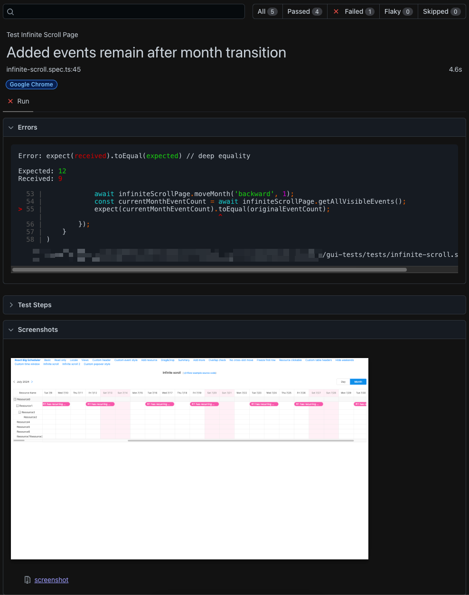

# GUI Automation Tests Overview

This project contains GUI tests for an open-source “Scheduler” web app.

The "Scheduler" is a sample web app for scheduling events. 
It provides a user interface for managing events, including operations like adding events, navigating through the calendar and more.

The project is written in `TypeScript` and uses the `Playwright` automation framework.


---

# Project's Structure
The project utilizes Page Object Model (POM) design pattern.
Structure details:

| File Name                       | Description                                                                                                                               |
|---------------------------------|-------------------------------------------------------------------------------------------------------------------------------------------|
| `pages/base-page.ts`            | Base page object that provides common methods for all pages.                                                                              |
| `pages/home.ts`                 | Page object for "Scheduler" homepage.                                                                                                     |
| `pages/infinite-scroll.ts`      | Page object for infinite scroll page.                                                                                                     |
| `tests/`                        | Contain test files for the "Scheduler" web pages.                                                                                         |
| `tests/home.spec.ts`            | Tests for the "Scheduler" home page.                                                                                                      |
| `tests/infinite-scroll.spec.ts` | Tests for the infinity scroll page.                                                                                                       |
| `.env.template`                 | Template for `.env` file, you need to rename `.env.template` in order to run the project. Read root's `README.md` for installation steps. |
| `playwright.config.ts`          | `playwright` config for test runs.                                                                                                        |

---

# Installation
Follow the installation steps in the root's `README.md` file.

---

# Configuration

In order to run the project, you will need to set up `.env` file in `api-tests` directory.

Run this command to create `.env` from `.env.template` file:

```bash
cp .env.template .env
```

### Environment Variables

`.env` contains 2 mandatory variables.

1. `GUI_BASE_URL` - The base URL `playwright` will navigate to, each time `page` object is being called.
2. `Protocol` - The protocol of `GUI_BASE_URL`.

### Configuration Options

* Timeout for test execution is **30 seconds**.
* Assertion's timeout is **5 seconds**.
* Tests are running in **headless mode**.
* Browser used is **Chrome Desktop**.

---

# Writing Tests
This section provides guidelines for writing GUI tests in the `gui-tests` project.

### Creating New Tests & Files
Project written using Page Object Model design pattern. 
You can read more about it here: https://playwright.dev/docs/pom.

Each page that the web application provides should have its own page object under the `pages` directory.
For instance, all methods related to the "Scheduler" home page should be located in the `pages/home.ts` file.


### Writing Tests
Here’s an example of a test for the Scheduler home page:

* Use `test.describe` to group tests and `test` to write a test.
* Add `let schedulerHomePage: SchedulerHomePage;` to `describe` block.
* Create a new instance of the `SchedulerHomePage` class using `const schedulerHomePage = new SchedulerHomePage(page);` in a `beforeEach` hook for each test.
* Keep in mind page locators are private and should be accessed only through the page class methods.


```typescript
test.describe('Test Scheduler Home Page', () => {
    let schedulerHomePage: SchedulerHomePage;

    test.beforeEach(async ({page}) => {
        schedulerHomePage = new SchedulerHomePage(page);
        await schedulerHomePage.navigatePage();
    });

    test('Switch to infinite scroll page', async () => {
        await schedulerHomePage.switchToInfiniteScroll();
        await schedulerHomePage.verifyHeaderTextContains('Infinite scroll(</>View example source code)');
        await schedulerHomePage.verifyUrlContains('/infinitescroll');
    });
});
```


### Writing Assertions
Assertions are written using the expect built-in function provided by `Playwright`.

While you can write any assertion in the test's block, I recommend writing the complex assertions on the page class.
This way, the test will be more readable, maintainable, and you will be able to utilize code reuse.

```typescript
class SchedulerHomePage extends BasePage {

    public async verifyHeaderTextContains(expectedText: string): Promise<void> {
        const headerText = await this.getHeaderText('h3');
        expect(headerText).toContain(expectedText);
    }
}
```
# Running Tests

`Playwright` offers a variety of command options to run the tests.

| Command                                             | Description                                                                                      |
|-----------------------------------------------------|--------------------------------------------------------------------------------------------------|
| `npm run test-api`                                  | Use `package.json` script to run all tests.                                                      |
| `npx playwright test`                               | Use `playwright` installed in root's `node_modules` to run tests.                                |
| `npx playwright test tests/home.spec.ts`            | Run only `home.spec.ts` tests.                                                                   |
| `npx playwright test tests/infinite-scroll.spec.ts` | Run only `infinite-scroll.spec.ts` tests.                                                        |
| `npx playwright test --workers=1	`                  | Control amount of workers for parallel execution. 1 worker means test run won’t run in parallel. |
| `npx playwright test --headed`                      | Run in headed mode. In `playwright.config.ts` the option `fullyParallel` is set to `true`.       |


# Reporting

For more reporting information, refer to the root's `README.md` file.

GUI tests on failure will generate a screenshot in the `root/test-results` directory and will be attached it to the extended report of the failed test.

